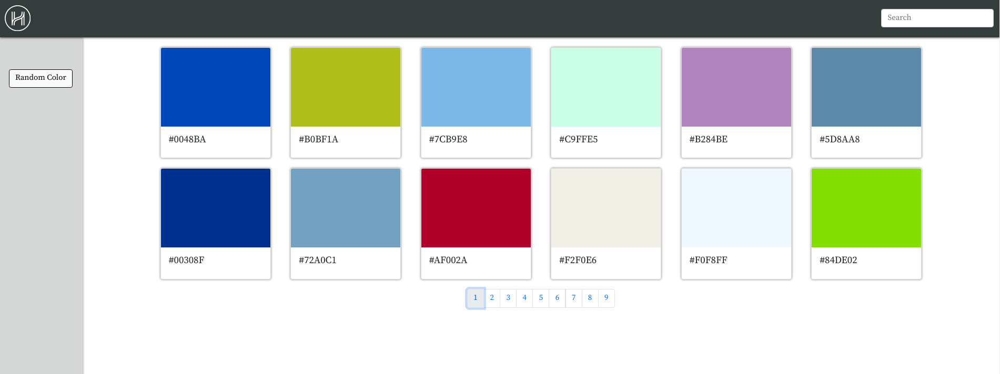
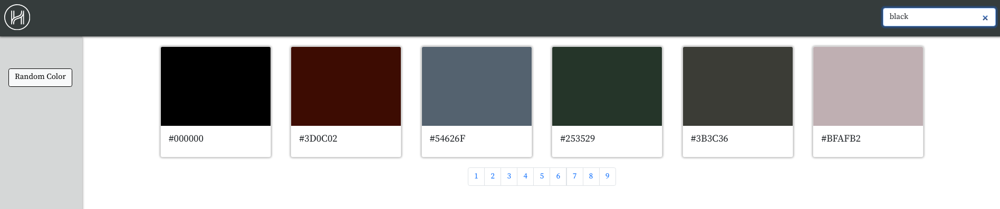
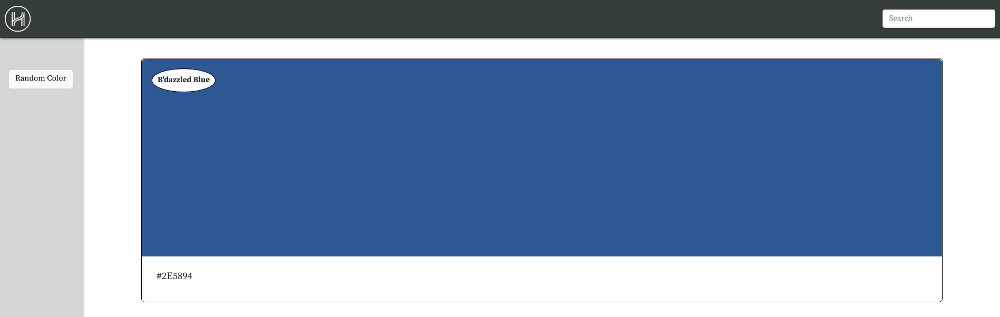

# COLOR SWATCH APP

A challenge from Helpful Human (see challenge https://github.com/HelpfulHuman/interview-challenge).

## Features

* Search a paginated database of 100 colors.

* Click on colors swatches to view details.

* Find random colors.

## Overview

The project challenge required you to create an API (https://github.com/bookert921/colors-server) with a pagination of about 100 colors. For this, I used Node/ExpressJs and PostgreSQL/Sequelize for my server and database. Then, create a fontend to display a list view and details view of each of the colors with a hex value title.

As a bonus you could create a graphQL endpoint, generate color list from a script (group colors by their values into red, yellow, grey, etc.), or make it responsive.

All things considered you have 2-3 days to deliver and this is what I came up with in that timeframe.

### 

### 

### 

## Technologies and Code Snippets

For the frontend I used create-react-app because it was a challenge project and I wanted to start basic, if it ever turned into a real thing, I would probably upgrade it to NextJS which I was tempted to do for most of the project anyway for SSR, SSG, image optimization, and less handling of routes. In addition, I use React Hooks because it was much easier to pass state around for reuse without having to use Redux or intricate prop drilling between the color views and the searchbar within the header.

Bootstrap was used for all the styling because upon first glance that's what it looked like they used in the examples given. I'm not a big fan of bootstrap, as from my experience, it can be difficult to work with and modify. However, this project was simple enough for me not to worry.

Axios was used to fetch data from my server just to make my life easier and Firebase Hosting was used to host the app because besides being a React fanboy, I'm also a huge fan of Google.

### Some of the most useful code snippets include:

```
 const allCards = [];

colors.forEach(color => {
    const { id, color_name, hex_value } = color;
    if (color_name.toLowerCase().indexOf(searchField.toLowerCase()) === -1) {
        return;
    }
    allCards.push(<ColorCard key={id} id={id} hex={hex_value} color={color_name} />)
})

/* Pagination View */
const colorsPerPage = 12
const indexOfLastColorSet = currentPage * colorsPerPage;
const indexOfFirstColorSet = indexOfLastColorSet - colorsPerPage;
const paginationView = allCards.slice(indexOfFirstColorSet, indexOfLastColorSet);


return (
    <div className="color-list">
        {searchField ? allCards : paginationView}
    </div>
);
```

When I initially hosted the project I noticed that my search only searched from the color swatches displayed rather than searching the complete database. That was an easy fix with the conditional operator.

```
const ColorCard = ({ id, color, hex }) => {
    let history = useHistory();

    const handleColorSelect = (id) => {
        history.push(`/colors/${id}`)
    };

    return (
        <div className="card" onClick={() => handleColorSelect(id)} >
            <div className="card-img-top"
                style={{ backgroundColor: hex }}
                title={color}
                alt={color}></div>
            <div className="card-body">
                <h5 className="card-title">{hex}</h5>
            </div>
        </div>
    );
};

export default ColorCard;
```

Here is how each card is displayed and how each card uses useHistory to diplay the details of the selected color. Random Color uses the same logic.

I did try creating groupings for colors using https://era86.github.io/2011/11/15/grouping-html-hex-colors-by-hue-in.html as a source and quite a few StackOverflow articles. However, given the time I wasn't able to get it working. The method suggested from the link provided did sort the colors but I believe there has to be a more consistent way. I created an additional sorting algorithm after to take the hue values in a specific range and pushed them to their respective containers. For example, if hue < 30 group as red. But I was getting about 34 of my 100 colors within that grouping and most of them were blue. A 210 > hue < 240 yielded 0 results which was suppose to be blue.

## Next Steps

As time permits, I want to learn more about how colors are separated so I can better understand the methods employed in apps like Coolors for example. I enjoy challenges and while I did not finish ALL of the challenges in the permitted time. I want to know that I can do it. I think it would be a good exercise for working with searching and sorting algorithms to provide a view based use input. I also want to revamp by server to utilize a graphql endpoint and implement some typescript just because these were my original intentions.

For now, my focus must shift but in the near future be sure to check back to see the finished app! I also challenge YOU to create the app yourself.

### For more information about the amazing consultancy and product providing startup Helpful Human please be sure to visit their website at https://www.helpfulhuman.com/ and speak with Mark Sandeno!
